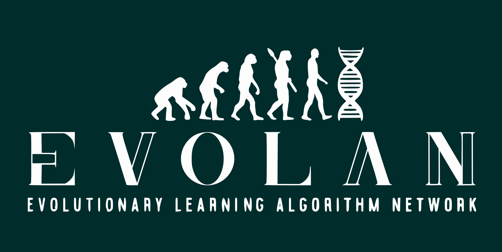

# Evolan
**Evolutionary Learning Algorithm Network**

Evolan is an environment where things (bots) live in a 2D world.  
The bots have a genome consisting of n genes. A gene is a 32 bit number declaring the source and target neuron ant it's weight.  
The bots live and move in the world until the end of a generation. Then the genomes of the surviving bots, selected by a criteria, are passed on to the next generation.  
The generations are stored in .json files. The programm supports .tar.lz4 format (.EVOLAN).  
Currently many neurons, criterias and the UI are not supported yet.
